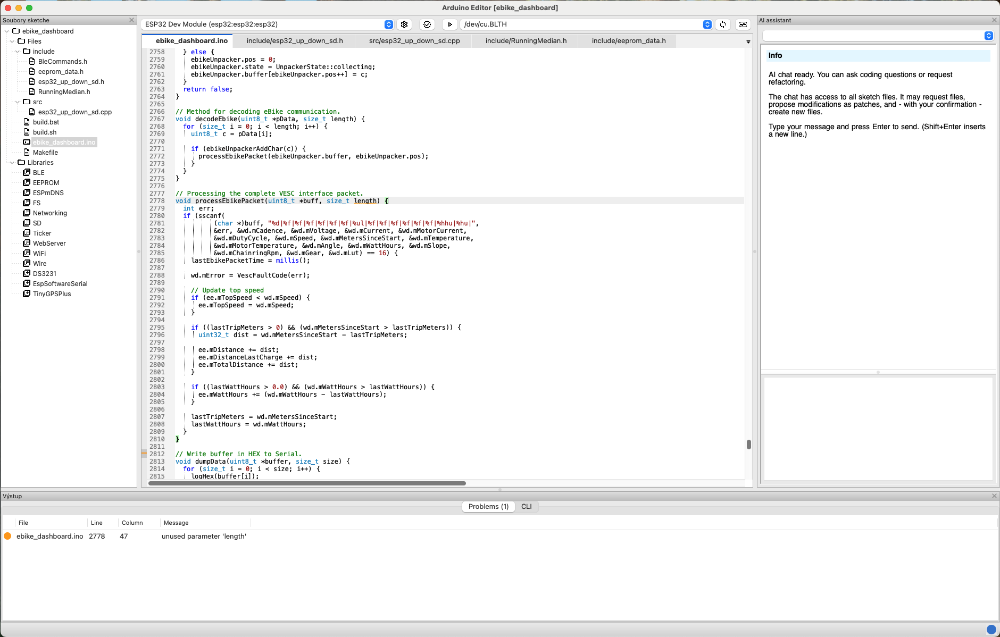
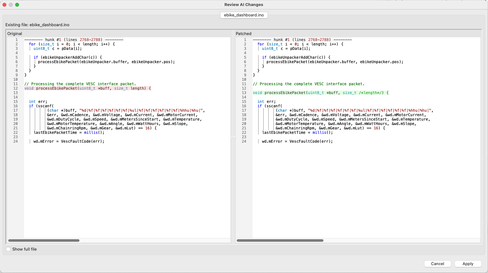
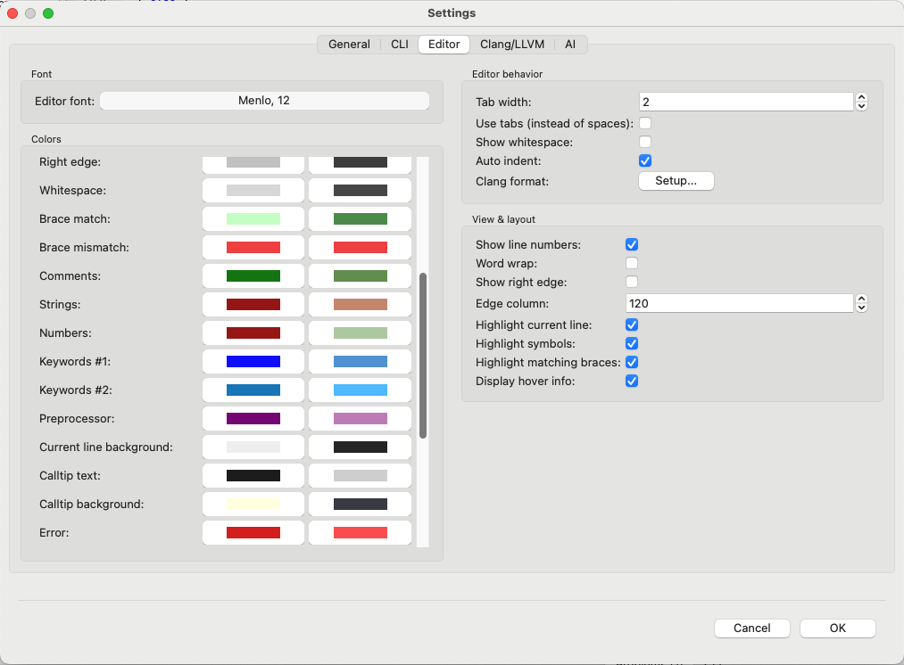

<p align="left">
  
</p>

# Arduino Editor


**Modern Arduino IDE powered by Clang**

*Fast code completion. Smart navigation. No nonsense.*

<picture>
  <source media="(prefers-color-scheme: dark)" srcset="doc/main-dark.png">
  <source media="(prefers-color-scheme: light)" srcset="doc/main-light.png">
  
</picture>

Arduino Editor is a modern development environment for Arduino projects built
on the Clang toolchain. It provides fast and precise code completion, smart
navigation tools, real-time error highlighting, and full support for
multi-file Arduino sketches.

The goal of the project is to offer a stable, powerful, and professional IDE
as a drop-in alternative to the official Arduino IDE, without sacrificing
control, transparency, or performance.

## Key features

- **Asynchronous processing**  
  The UI stays responsive even when working with large projects.

- **Smart navigation**  
  Go to definition, follow symbols, and view detailed hover information.

- **Clang-based engine**  
  Parsing, symbol resolution, diagnostics, and code completion are powered by
  Clang for accuracy and semantic correctness.

- **Project-wide support**  
  Structured sketches with multiple `.ino`, `.cpp`, and `.hpp` files are fully
  supported.

- **Advanced refactoring**  
  Safe, semantic code transformations with full user control.

- **AI-assisted development**  
  Patch-based edits with diff preview and explicit confirmation before applying
  changes.

<picture>
  <source media="(prefers-color-scheme: dark)" srcset="doc/diff-dark.png">
  <source media="(prefers-color-scheme: light)" srcset="doc/diff-light.png">
  
</picture>

- **Configurable editor**  
  Fonts, colors, formatting, and editor behavior can be customized.

<picture>
  <source media="(prefers-color-scheme: dark)" srcset="doc/settings-dark.png">
  <source media="(prefers-color-scheme: light)" srcset="doc/settings-light.png">
  
</picture>

- **Arduino CLI integration**  
  Building, uploading, and toolchain management are handled via `arduino-cli`.

## Project structure

```text
src/        Application source code
build/      Makefiles and platform-specific build logic
resources/  Icons and bundled assets
```

## Building from source

Instructions for building Arduino Editor from source on all supported
platforms (macOS, Linux, Raspberry Pi, Windows cross-build) are available in:

👉 **[BUILDING.md](BUILDING.md)**

## Downloads

Prebuilt binaries are available on the GitHub Releases page:

👉 **https://github.com/ppet36/ArduinoEditor/releases**

### Available packages

- **macOS**
  - Signed and notarized `.pkg` installer

- **Linux**
  - `.AppImage` (portable, no installation required)

- **Raspberry Pi**
  - `.AppImage`
  - `.deb` package (ARM64)

- **Windows**
  - Installer
  - Portable `.zip` archive

This project is licensed under the GNU General Public License v3.0.
See the LICENSE file for details.

